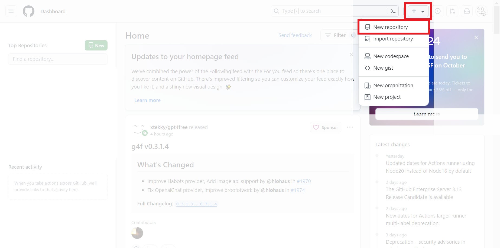
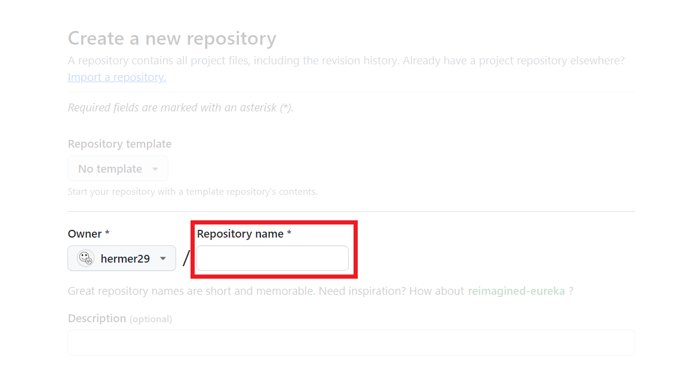
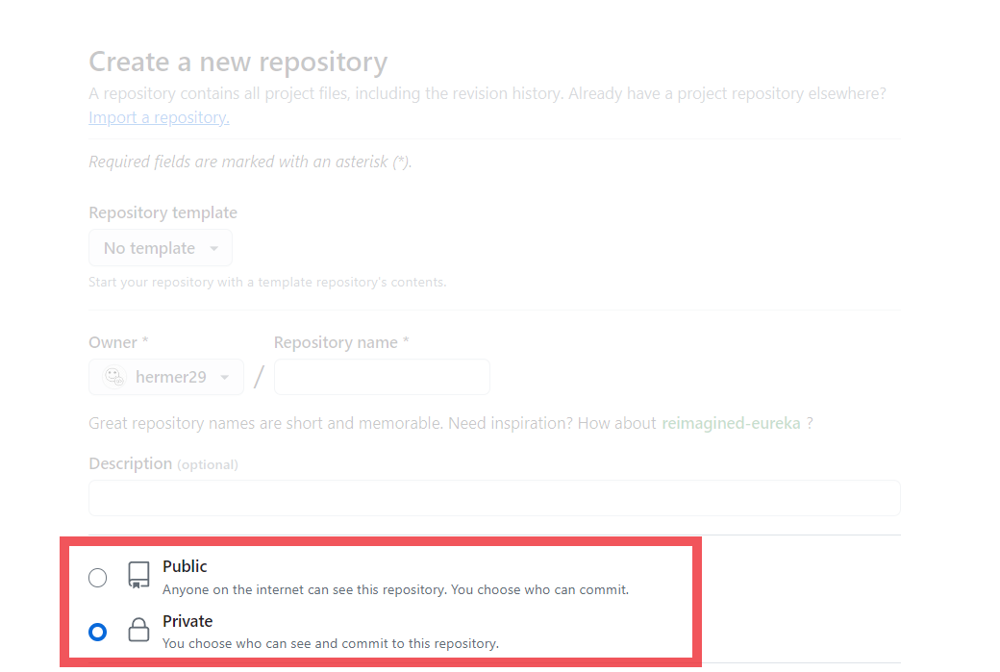
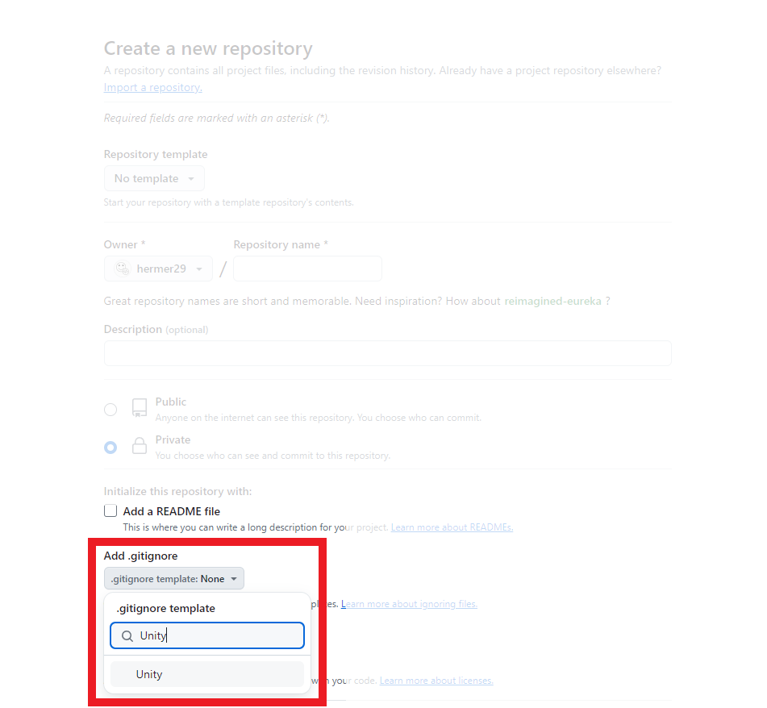

# Как создать github репозиторий

1. Заходим в github.com
2. Входим в аккаунт если не вошли
3. Нажимаем на кнопку "+" сверху справа и нажимаем "New repository"

    
Где эти кнопки?

4. Выбираем имя репозитория и вводим его в поле Repository name

    
Где написать имя репозитория?

5. Выбираем пункт Private

    
Где пункт Private?

6. (Если Unity проект) Нажми на ".gitignore template: None" введи в поиске "Unity" и выбери найденный шаблон

    
Куда нажимать? Куда вводить "Unity"?

7. Нажимаем зелёную кнопку "Create repository" снизу справа

