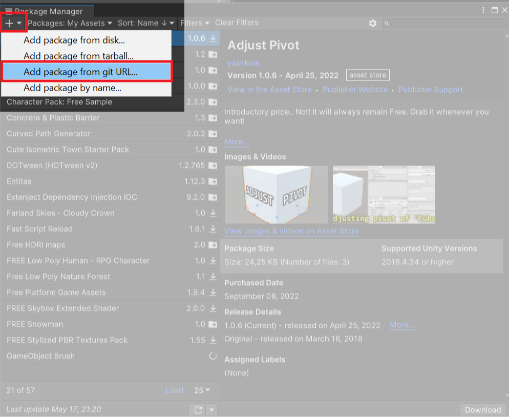

# Установка git библиотек

1. Заходим в меню Window -> Package Manager
2. Нажимаем на кнопку "+" сверху слева и выбираем "Add package from git URL..."

3. В появившееся поле вводим url и нажимаем "add"

## Частые проблемы

1. Если у url нет расширения ".git" в конце, тогда package manager будет давать ошибку в консоли после добавления
2. git должен быть установлен на компьютере, чтобы это работало. Установку можно скачать по [этой](https://git-scm.com/download/win) ссылке