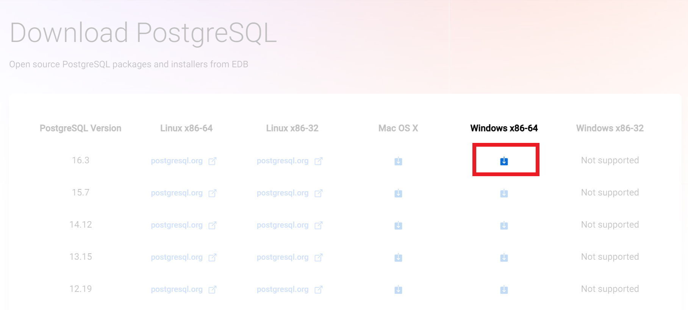

# Как установить Postgre SQL

1. Перейди на сайт https://www.enterprisedb.com/downloads/postgres-postgresql-downloads
2. Нажми на кнопку скачивания последней версии для своей платформы

    
Пример для Windows x64

3. Дождаться скачивания программы установки и запустить её
4. На первой странице нажимаем "Next >"
5. Выбираем папку, куда postgres установится, нажимаем "Next >"
> Установка произойдёт внутри указанной папки. Если укажешь папку C:/Programs, файлы postgres появятся внутри папки Programs. Поэтому путь в таком случае должен быть C:/Programs/PostgresSQL
6. Выбираем все галочки (если уже не выбраны) и нажимаем "Next >"
7. Выбираем папку для хранения баз данных, нажимаем "Next >"
8. Придумываем пароль для суперпользователя postgres и записываем его в текстовый документ на рабочем столе (можно попроще)
9. В программе установки вводим этот пароль, повторяем ввод и нажимаем "Next >"
10. На странице выбора порта нажимаем "Next >"
11. На странице выбора локализации нажимаем "Next >"
12. На странице summary установки нажимаем "Next >"
13. Нажимаем "Next >"
14. Дожидаемся окончания установки 
15. Снимаем галочку в конце установки