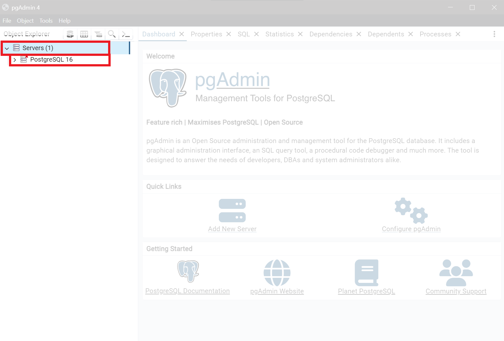

# Как начать писать SQL код

> Это руководство является логическим продолжением руководства:
> - [Как установить Postgre SQL](./install-postgre-sql-windows.md)
> 
> Рекомендуется предварительно пройти его

1. Запустить программу ```<папка установки Postgre>/pgAdmin 4/runtime/pgAdmin4.exe```
2. В меню Object Explorer слева, раскрываем список Servers и нажимаем на имеющийся сервер
<details>
<summary>Куда нажимать?</summary>


</details>

3. Вводим пароль, который мы запомнили в процессе установки Postgre

<details>
<summary>Куда писать пароль?</summary>


</details>

4. Отмечаем галочкой Save Password
5. Нажимаем кнопку OK
6. Раскрываем список Databases, если он не раскрыт, затем нажимаем правую кнопку мыши на "postgres"

<details>
<summary>Куда нажимать?</summary>


</details>

7. В появившемся контекстном меню нажимаем Query Tool
<details>
<summary>Куда нажимать?</summary>


</details>

8. Пишем SQL код в поле Query

<details>
<summary>Где это поле?</summary>


</details>
